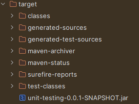
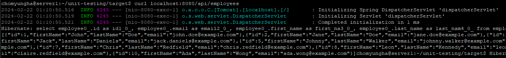
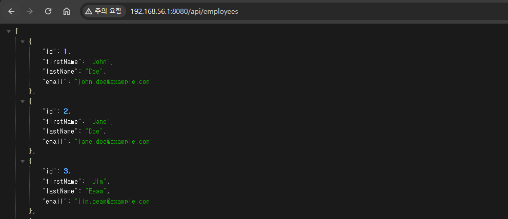

# 우분투 리눅스에서 .jar 파일 실행하기

1. apt-install ? apt-update
2. jvm 설치
3. maven 설치
4. 소스 코드 깃허브에 올리기
5. git clone 으로 우분투에서 파일 받기
6. mvn package 명령어를 통해 소스 코드 .jar파일로 패키징

7. mysql 설치 및 계정 생성
8. employees 테이블 생성
9. data.sql에 있는 sql문으로 데이터 삽입
10. target 폴더로 이동 후 java -jar unit-testing.... & 로 백그라운드 실행
11. curl localhost:8080/api/employees로 확인

13. 윈도우에서 virtualbox ip 확인하고 브라우저에서 해당 ip:8080/api/employeess로 접속해서 확인
    